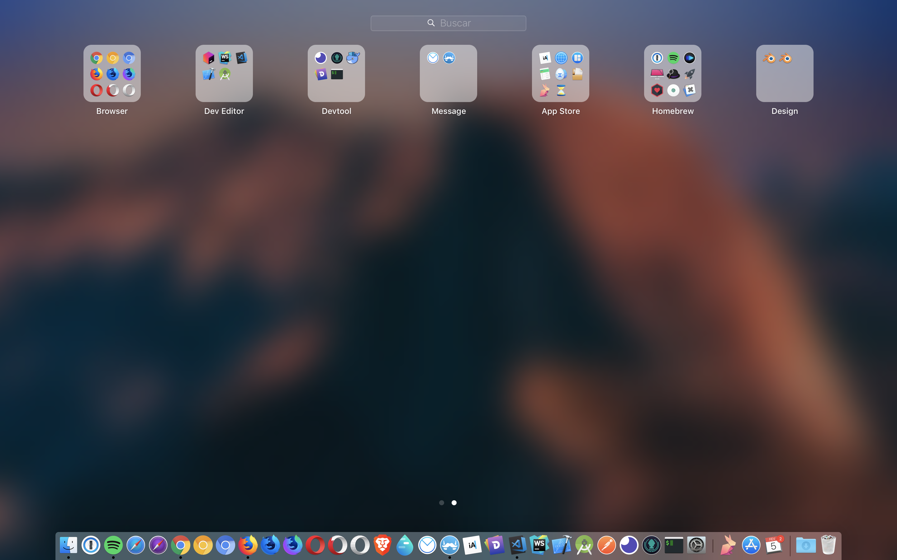

# Configurar MacOS

Tutorial para configurar o macOS.

## Developer Tools

### Homebrew

O mac não tem um apt-get, mas tem o [Homebrew](https://brew.sh/index_pt-br) para instalar e gerenciar, ferramentas de linha de comando e softwares.

Instalar o gerenciador de pacotes:

```shell
/usr/bin/ruby -e "$(curl -fsSL https://raw.githubusercontent.com/Homebrew/install/master/install)"
```

### Git

Instalar ferramenta de controle de versão:

```shell
brew install git
brew install git-flow-avh
```

Configurar informações do [git](https://git-scm.com):

```shell
git config --global user.email "you@example.com"
git config --global user.name "Your Name"
```

### ssh

#### Generating a new SSH key

```shell
ssh-keygen
```

or

```shell
ssh-keygen -t rsa -b 4096 -C "Username, Machinename - Macbook Pro, Personal - Wednesday, 06 June 2018" -N "passphrase"
```

#### Copy key to clipboard

```shell
cat ~/.ssh/id_rsa.pub | pbcopy
```

#### Criar arquivo de configuração para multiplas chaves

Para ler sobre, [clique aqui](https://gist.github.com/jexchan/2351996).

```
# work account

Host github.com-work
  HostName github.com
  User git
  IdentityFile ~/.ssh/id_rsa_work

# personal account

Host github.com-personal
  HostName github.com
  User git
  IdentityFile ~/.ssh/id_rsa_personal

Host bitbucket.org
  HostName bitbucket.org
  User git
  IdentityFile ~/.ssh/id_rsa_personal
```

### oh-my-zsh

Instalar o zsh e o [oh-my-zsh](https://github.com/robbyrussell/oh-my-zsh) para ter um terminal mais inteligente:

```shell
sh -c "$(curl -fsSL https://raw.githubusercontent.com/robbyrussell/oh-my-zsh/master/tools/install.sh)"
```

#### Adicionar plugins:

Instalar o plugin `zsh-autosuggestions` para o `oh-my-zsh`:

```shell
git clone https://github.com/zsh-users/zsh-autosuggestions ${ZSH_CUSTOM:-~/.oh-my-zsh/custom}/plugins/zsh-autosuggestions
```

Adicionar o plugin ao arquivo `.zshrc`:

```shell
plugins=(
  git
  zsh-autosuggestions
)
```

#### Customizações dos temas:

##### `powerlevel9k`:

Para usar as configurações, basta baixar o repositório.

```shell
cd ~
git clone https://github.com/JonathanBergson/powerlevel9k
```

Adicionar a linha abaixo há um dos dois arquivos `.zshrc` ou `.bashrc`:

```shell
source ~/powerlevel9k/config.sh
```

ou execute o comando:

```shell
echo "\n\nsource ~/powerlevel9k/config.sh" >> ~/.zshrc
```

#### Selecionar temas:

##### Baixar e instalar:

```shell
git clone https://github.com/bhilburn/powerlevel9k.git $ZSH_CUSTOM/themes/powerlevel9k
git clone https://github.com/oskarkrawczyk/honukai-iterm-zsh.git $ZSH_CUSTOM/themes/honukai
git clone https://github.com/carloscuesta/materialshell.git $ZSH_CUSTOM/themes/materialshell
```

##### Para ativar o tema é necessário modificar o arquivo `.zshrc`:

```shell
## Default themes

ZSH_THEME="agnoster"
ZSH_THEME="gnzh"
ZSH_THEME="amuse"

## Custom themes

ZSH_THEME="powerlevel9k/powerlevel9k"
ZSH_THEME="honukai/honukai"
ZSH_THEME="materialshell/materialshell"
```

### Shell

Para adicionar e utilziar os snippets, basta baixar o repositório:

```shell
cd ~
git clone https://github.com/JonathanBergson/shell.git
```

Adicionar a linha abaixo há um dos dois arquivos `.zshrc` ou `.bashrc`:

```shell
source ~/shell/snippets.sh
```

ou execute o comando:

```shell
echo "\n\nsource ~/shell/snippets.sh" >> ~/.zshrc
```

### Node

Instalar o gerenciador de versão do node:

```shell
brew install nvm
```

Adicionar a variável de ambiente no arquivo `.zshrc` ou `.bashrc`:

```shell
export NVM_DIR="$HOME/.nvm"
. "/usr/local/opt/nvm/nvm.sh"
```

Instalar a versão `lts` do node:

```shell
nvm install --lts
```

### npm

Configurar as variáveis default do [npm](npmjs.com):

```shell
npm config set init-author-name "Your name"
npm config set init-author-email "name@domain.com"
npm config set init-author-url "http://domain.com"
npm config set init-license "MIT"
```

### React Native

Instalar as dependencias do React Native:

```shell
brew install node
brew install watchman
```

Instalar o pacote do React Native:

```shell
npm install -g react-native-cli
```

Ou use o `yarn`:

```shell
yarn global add react-native-cli
```

Adicionar a variável de ambiente no arquivo `.zshrc` ou `.bashrc`:

```shell
export ANDROID_HOME=$HOME/Library/Android/sdk
export PATH=$PATH:$ANDROID_HOME/emulator
export PATH=$PATH:$ANDROID_HOME/tools
export PATH=$PATH:$ANDROID_HOME/tools/bin
export PATH=$PATH:$ANDROID_HOME/platform-tools
```

### Java

Instalar o JDK:

```shell
brew cask install oracle-jdk
```

Adicionar a variável de ambiente no arquivo `.zshrc` ou `.bashrc`:

```shell
export JAVA_HOME=/Library/Java/JavaVirtualMachines/jdk-11.0.1.jdk/Contents/Home/
```

## Itens

Instalar drivers, fontes e softwares utilizando a linha de comando:

```shell
brew tap caskroom/cask
brew tap caskroom/fonts
```

Fontes que você vai precisar para programar no mac:

```shell
brew cask install homebrew/cask-fonts/font-fira-code
brew cask install homebrew/cask-fonts/font-source-code-pro
```

Outras fontes:

```shell
brew cask install font-sans-forgetica
```

Instalar softwares direto da AppStore:

```shell
## Install
brew install mas

## Singin
mas signin mas@example.com "13245678"

## Software to install
# Apple
mas install 409183694     # Keynote
mas install 409203825     # Numbers
mas install 409201541     # Pages

# Browser
mas install 1077036385    # Fluid Browser

# Message
mas install 918858936     # Airmail 3
mas install 1059655371    # Newton
mas install 1176895641    # Spark

# Utility
mas install 775737590     # iA Writer
mas install 441258766     # Magnet

# Other
mas install 926121450     # Coinverter
mas install 1081413713    # GIF Brewery 3
mas install 1437226581    # Horo
mas install 884952790     # iTranslate

#MacPaw
mas install 935235287     # Encrypto
mas install 1090488118    # Gemini 2
mas install 425424353     # The Unarchiver
mas install 1266674560    # Wallpaper Wizard
```

## Softwares

Navegadores:

```shell
brew cask install blisk
brew cask install brave-browser
brew cask install google-chrome
brew cask install google-chrome-canary
brew cask install chromium
brew cask install firefox
brew cask install homebrew/cask-versions/firefox-developer-edition
brew cask install firefox-nightly
brew cask install opera
brew cask install opera-developer
brew cask install torbrowser
```

Editores de texto:

```shell
brew cask install android-studio
brew cask install atom
brew cask install hyper
brew cask install iterm2
brew cask install sublime-text
brew cask install visual-studio-code
brew cask install webstorm
```

Ferramentas de desenvolvimento:

```shell
brew cask install dash
brew cask install docker
brew cask install github
brew cask install gitkraken
brew cask install insomnia
brew cask install postman
brew cask install react-native-debbuger
brew cask install reactotron
brew cask install sourcetree
```

Gerenciadores de banco de dados:

```shell
brew cask install sequel-pro
brew cask install datagrip
brew cask install navicat-for-postgresql
brew cask install pgadmin4
```

Programas de mensagem:

```shell
brew cask install discord
brew cask install franz
brew cask install messenger
brew cask install slack
brew cask install telegram-desktop
brew cask install whatsapp
```

Programas de música e mídia:

```shell
brew cask install deezer
brew cask install iina
brew cask install spotify
brew cask install vlc
```

Programas para designer:

```shell
brew cask install blender
brew cask install aseprite
brew cask install gimp
brew cask install magicavoxel
```

Apps para jogar:

```shell
brew cask install battle-net
brew cask install openemu
brew cask install steam
```

Utilitários:

```shell
brew cask install 1password
brew cask install alfred
brew cask install bartender
brew cask install cheatsheet
brew cask install cleanmymac
brew cask install command-tab-plus
brew cask install etcher
brew cask install iexplorer
brew cask install rocket
brew cask install vanilla
brew cask install virtualbox
brew cask install webtorrent
```

Proteção de tela, frescura de quem usa mac:

```shell
brew cask install fliqlo
brew cask install padbury-clock
```

## Browser Extensios

##### Generic

- 1Password - [link](https://1password.com/downloads/mac/#browsers)

##### Privacy

- Ghostery - [link](https://www.ghostery.com/)
- HTTPS Everywhere - [link](https://www.eff.org/https-everywhere)
- Privacy Badger - [link](https://www.eff.org/privacybadger)

##### Developer

- CodeCopy - [Repository](https://github.com/zenorocha/codecopy), [Firefox](https://addons.mozilla.org/en-US/firefox/addon/codecopy/), [Chrome](https://chrome.google.com/webstore/detail/codecopy/fkbfebkcoelajmhanocgppanfoojcdmg)
- React Developer Tools - [Repository](https://github.com/facebook/react-devtools), [Firefox](https://addons.mozilla.org/firefox/addon/react-devtools/), [Chrome](https://chrome.google.com/webstore/detail/react-developer-tools/fmkadmapgofadopljbjfkapdkoienihi)
- Redux DevTools Extension - [Repository](https://github.com/zalmoxisus/redux-devtools-extension), [Firefox](https://addons.mozilla.org/en-US/firefox/addon/reduxdevtools/), [Chrome](https://chrome.google.com/webstore/detail/redux-devtools/lmhkpmbekcpmknklioeibfkpmmfibljd)

## Drivers

Instalar drivers:

```shell
brew cask install logitech-options
brew cask install homebrew/cask-drivers/razer-synapse
brew cask install xbox360-controller-driver-unofficial
```

## Sublime Text 3

Packages:

- Babel
- Material Theme
- Material Theme - Appbar
- Package Control

Settings:

```json
{
  "always_show_minimap_viewport": true,
  "bold_folder_labels": true,
  "color_scheme": "Packages/Material Theme/schemes/Material-Theme-Darker.tmTheme",
  "draw_white_space": "all",
  "ensure_newline_at_eof_on_save": true,
  "folder_exclude_patterns":
  [
    ".svn",
    ".git",
    ".hg",
    "CVS",
    "node_modules",
    "coverage"
  ],
  "font_face": "Fira Code",
  "font_options":
  [
    "gray_antialias"
  ],
  "highlight_line": true,
  "ignored_packages":
  [
    "Vintage"
  ],
  "indent_guide_options":
  [
    "draw_normal",
    "draw_active"
  ],
  "line_padding_bottom": 2,
  "line_padding_top": 2,
  "material_theme_accent_charcoal": true,
  "material_theme_appbar_charcoal": true,
  "material_theme_bullet_tree_indicator": true,
  "overlay_scroll_bars": "enabled",
  "rulers":
  [
    100
  ],
  "shift_tab_unindent": true,
  "tab_size": 2,
  "theme": "Material-Theme-Darker.sublime-theme",
  "translate_tabs_to_spaces": true,
  "trim_trailing_white_space_on_save": true,
  "word_wrap": true,
  "wrap_width": 100
}
```

Keybinding:

```json
[
  { "keys": ["super+b"], "command": "toggle_side_bar" },
]
```

## Sistema

### Preferências do Sistema

Cantos de acesso rápido:


Teclado:


### Dashboard

Apple apps:


Meus apps:


